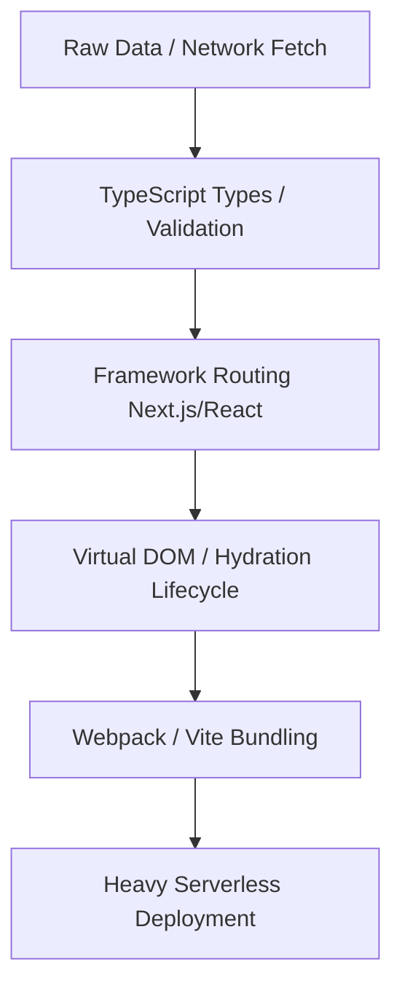

# Sesi: The Paradigm of Agent-Native Programming

> **Abstract:** Traditional programming languages and modern frameworks (TypeScript, Rust, React, Next.js) were engineered to optimize for human visual reading, IDE autocompletion, and heavy runtime environments. However, these paradigms introduce massive cognitive friction, context-window token bloat, and compilation indeterminism for Large Language Models (LLMs). **Sesi** represents a fundamental departure: a language designed from the ground up to align perfectly with the linear, deterministic, step-by-step reasoning architectures of AI coding agents.

---

## 1. The Mismatch of Legacy Human-First Architectures

In the legacy software stack, a simple task like "fetch data, build a styled view, and generate a sitemap" requires a complex, multi-layered architecture:



For a human, these abstractions feel robust because they enforce structure over large teams. For an **AI Agent**, this stack is a source of severe friction:
* **Syntax Surface Mismatch:** The code is fragmented across async boundaries, server/client files, TypeScript interfaces, and bundler configurations. The agent must spend valuable reasoning tokens managing *configuration* rather than *logic*.
* **Hydration & State Loops:** Framework lifecycles (like React hooks or Vue reactivity) force the agent to reason about state reconciliation over time, rather than pure data transformation.
* **Token Sprawl (Import Hell):** Compiling a site requires importing hundreds of npm packages. Each import expands the potential error boundary, filling the agent’s context window with stale or irrelevant documentation.

---

## 2. Why Sesi "Speaks" the Way an AI Agent Thinks

Sesi aligns with the core cognitive mechanics of LLM generation. When an agent writes code, it generates tokens linearly, predicting the next logical step based on sequential reasoning. Sesi matches this cognitive loop step-for-step.

```
AI Reasoning Loop:   [Reasoning Step] ──> [Deterministic Code Instruction] ──> [Next Step]
                                                 │
Sesi Primitive:                              [Linear execution, no boilerplate]
```

### A. Linear, Side-Effect Driven Execution
Sesi eliminates the need for boilerplate entry wrappers (like `public static void main` or TypeScript export classes). The code executes exactly in the order it is authored:
1. **Initialize** environment settings.
2. **Fetch** remote context programmatically via `web_get()`.
3. **Parse** and map data structures with native list and object primitives.
4. **Compile** layout pages and stylesheets.

This direct, linear flow means the agent can write code exactly as it generates its step-by-step plan, maintaining a 1:1 mapping between logical intent and functional output.

### B. The Compact Context Window Surface
In Sesi, there are no heavy external package registries (like npm or PyPI) required to perform core tasks. Standard system capabilities are built directly into the language as first-class primitives:

| Category | Primitives / Built-ins | Purpose |
| :--- | :--- | :--- |
| **System I/O** | `read_file()`, `write_file()`, `list_dir()`, `make_dir()` | Complete, safe file and tree orchestration. |
| **HTTP Client** | `web_get()`, `web_send()` | Native zero-dependency network data aggregation. |
| **Orchestration** | `spawn()`, `exec()`, `time()`, `random()` | Threading, locks, and external compiler invocation. |
| **Data Parsing** | `to_json()`, `from_json()`, `split()`, `join()` | Standardized serialization out-of-the-box. |

By centralizing these capabilities, Sesi keeps the agent's context window completely clean. The agent never has to "guess" if an external library API changed or search through bloated NPM document trees.

### C. Millisecond Verification Loop (Tactile Reinforcement)
For an AI agent, compilation speed *is* reasoning speed. 
* In traditional stacks, a compile-test loop (running Jest, Vite bundling, or webpack compilation) takes **10 to 30 seconds**. If a syntax error occurs, the agent must wait, read a massive stack trace, and context-switch.
* In **Sesi**, the interpreter compiles and runs full multi-file publishing pipelines in **under 100 milliseconds**. If a syntax error occurs, Sesi immediately returns the precise line and column. This tight feedback loop acts as instant reinforcement, allowing the agent to self-correct syntax instantly.

### D. The "Factory Over Product" Pattern
Agents are inherently mathematical and algorithmic; they excel at building **repeatable automated factories** rather than hand-crafting visual components. Sesi encourages developers to write a compiler script (a "factory") that dynamically scans file trees and compiles pages programmatically, rather than forcing the agent to hand-write individual HTML assets.

---

## 3. Side-by-Side Comparison: Sesi vs. Legacy Node.js Stack

To illustrate the difference in cognitive overhead, let’s compare implementing a simple **Live Static Hydrator** (fetching JSON from an API and writing an index page) in both stacks:

### The Legacy Node.js Stack
```javascript
// Needs packages: axios, fs-extra, path, dotenv
import axios from 'axios';
import fs from 'fs-extra';
import path from 'path';
import dotenv from 'dotenv';

dotenv.config();

async function compileSite() {
  try {
    const response = await axios.get('https://api.example.com/data');
    const data = response.data;
    
    const html = `<html><body><h1>${data.title}</h1><p>${data.body}</p></body></html>`;
    const outputDir = path.resolve(process.cwd(), 'dist');
    
    await fs.ensureDir(outputDir);
    await fs.writeFile(path.join(outputDir, 'index.html'), html, 'utf-8');
    console.log('Site compiled.');
  } catch (error) {
    console.error('Pipeline failed:', error);
  }
}

compileSite();
```
* **Friction Points:** Asynchronous promise handling, nested string templates, explicit path resolution, error wrappers, and dependency imports.

### The Sesi Stack
```sesi
let response_raw = web_get("https://api.example.com/data")
let data = parse(response_raw)

let html = "<html><body><h1>" + data["title"] + "</h1><p>" + data["body"] + "</p></body></html>"
make_dir("dist")
write_file("dist/index.html", html)
print "Site compiled."
```
* **Friction Points:** **Zero.** Sesi executes synchronously, natively handles environment bindings, isolates paths safely under process directory scopes, and has zero boilerplate.

---

## 4. The Future of Agent-Native Software Development

As autonomous coding agents become the primary authors of the world’s software, human-centric visual frameworks will give way to **agent-native language systems**:

1. **Self-Compiling Ecosystems:** Agents will author local pipelines in Sesi to parse logs, test APIs, and assemble micro-frontends programmatically.
2. **Context-Optimized Tokenomics:** Companies will design internal languages with Sesi-like minimal syntax surfaces to dramatically lower their LLM inference costs and accelerate build times.
3. **Decoupled Markup & Styles:** By separating structural composition (`.sesi` modules) from the presentation stylesheets (`.css`), agents can guarantee perfect functional compliance, leaving visual refinements to separate style designers.

Sesi is not just a highly legible language for humans—it is the first true **compiler pipeline for the age of autonomous AI developers.**
