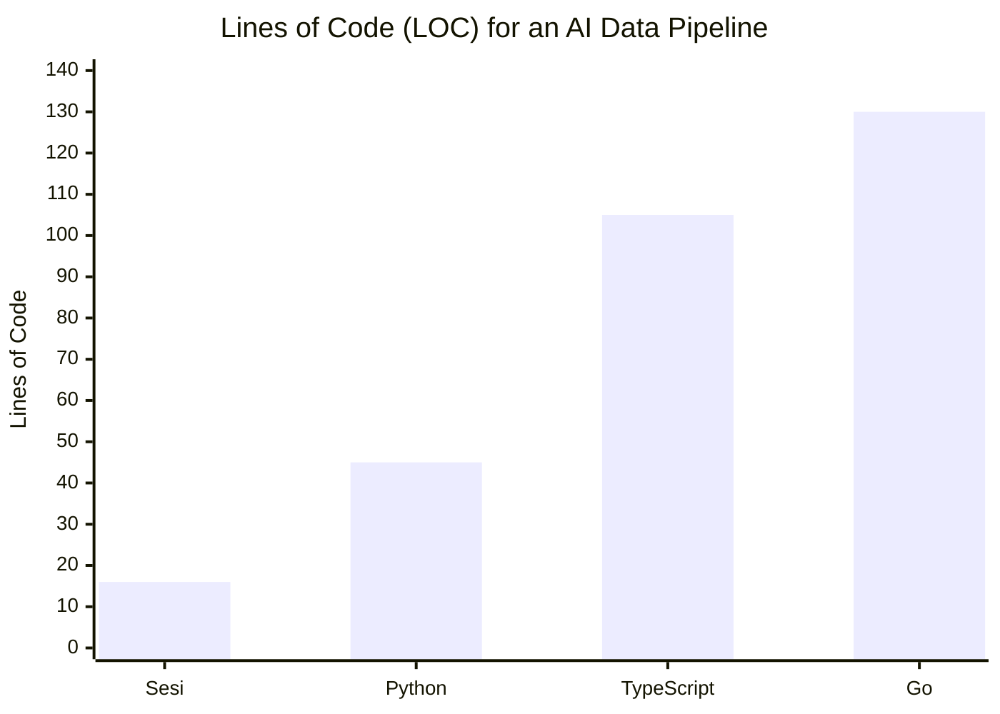
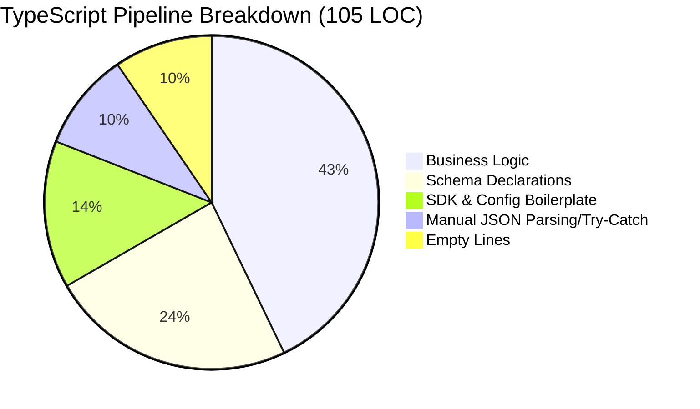
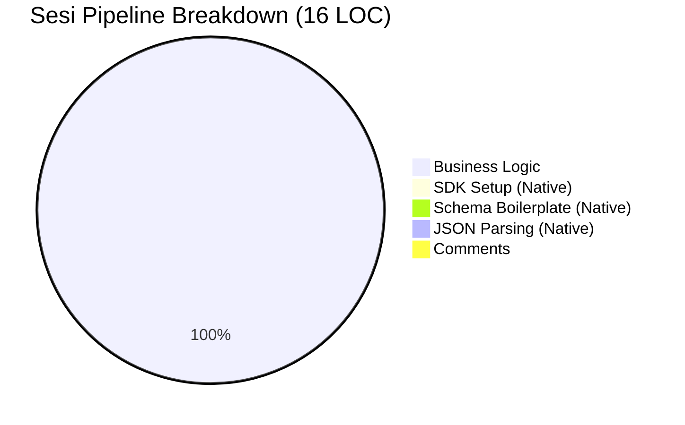

# The Sesi Advantage: Why We Built a Systems & Orchestration Language

Integrating Large Language Models (LLMs) into traditional applications today is painful. Standard programming languages treat AI as an external service requiring SDKs, manual prompt string concatenation, complex schema definitions, and fragile JSON parsing.

**Sesi treats Reasoning as a first-class language primitive.**

This document demonstrates exactly how much boilerplate and complexity Sesi eliminates compared to traditional languages like TypeScript, Python, and Go.

---

## 📊 The Cost of Boilerplate: A Data Comparison

When building a simple AI-powered data pipeline (structured data extraction + conditional function calling), traditional languages spend more than half their code managing the SDK rather than executing business logic.



### Where do the lines go?





---

## 💻 The Side-by-Side Comparison

We tasked four languages with building the same script:

1. Loop over customer feedback.
2. Extract structured data (Sentiment, Category, Urgency).
3. If urgent, execute a local function (`escalateTicket`).

### 1. The Sesi Implementation (16 Lines)

In Sesi, there are no SDK imports, no manual API key initializations, no complex schema builder libraries, mininmal to no comments, and no manual response parsing.

```sesi
fn escalateTicket(customerId: string, reason: string) {
  print "ESCALATION: Customer " + customerId + " for " + reason
  return "Escalation logged."
}
memory processingLog { "Pipeline Start:" }
let rawFeedback = ["My account was charged twice for the pro plan! Fix this now!", "The new dashboard is really clean, great job team.", "I can't figure out how to export my data to CSV, it just spins."]
for feedback in rawFeedback 
{processingLog = processingLog + "Processing: " + feedback
let analysis = structured_output({sentiment: string, category: string, isUrgent: bool, summary: string})
(model("gemini-3.1-flash-lite") {"Analyze the customer feedback. Category should be Billing, UI, or Technical. Feedback:" feedback})
print "Result for: " + analysis["summary"]
if analysis["isUrgent"] 
{let resolution = tool_call(escalateTicket)(model("gemini-3.1-flash-lite") {"Call escalateTicket for customer '1234' with an exact reason based on:" feedback})
processingLog = processingLog + "Urgent action taken: " + resolution} else {processingLog = processingLog + "Logged routinely."}}
print "--- Final Processing Log ---"
print processingLog
```

### 2. The TypeScript Implementation (105 Lines)

TypeScript requires the official Google Gen AI SDK. Notice how much code is dedicated just to telling the model _what_ we want it to do (Schemas, Tool Declarations) and _handling_ what it gives back (JSON.parse).

```typescript
import { GoogleGenAI, Type } from "@google/genai";

const ai = new GoogleGenAI({ apiKey: process.env.GEMINI_API_KEY });

// The tool we want the model to call
function escalateTicket(customerId: string, reason: string): string {
  console.log(`ESCALATION: Customer ${customerId} for ${reason}`);
  return "Escalation logged.";
}

// 1. Tool Declaration for the SDK (Boilerplate)
const escalateToolDeclaration = {
  functionDeclarations: [
    {
      name: "escalateTicket",
      description: "Escalate an urgent customer ticket",
      parameters: {
        type: Type.OBJECT,
        properties: {
          customerId: { type: Type.STRING, description: "ID of the customer" },
          reason: { type: Type.STRING, description: "Reason for escalation" }
        },
        required: ["customerId", "reason"]
      }
    }
  ]
};

async function processFeedback() {
  let processingLog = "Pipeline Start:\n";
  
  const rawFeedback = [
    "My account was charged twice for the pro plan! Fix this now!",
    "The new dashboard is really clean, great job team.",
    "I can't figure out how to export my data to CSV, it just spins."
  ];

  for (const feedback of rawFeedback) {
    processingLog += `Processing: ${feedback}\n`;
    
    // 2. Structured Data Extraction (Boilerplate Schema)
    const schema = {
      type: Type.OBJECT,
      properties: {
        sentiment: { type: Type.STRING },
        category: { type: Type.STRING, description: "Billing, UI, or Technical" },
        isUrgent: { type: Type.BOOLEAN },
        summary: { type: Type.STRING }
      },
      required: ["sentiment", "category", "isUrgent", "summary"]
    };

    const analysisResponse = await ai.models.generateContent({
      model: "gemini-3.1-flash-lite",
      contents: `Analyze the customer feedback. Category should be Billing, UI, or Technical.\nFeedback: ${feedback}`,
      config: {
        responseMimeType: "application/json",
        responseSchema: schema,
      }
    });

    // 3. Manual JSON parsing and error handling
    let analysis;
    try {
      analysis = JSON.parse(analysisResponse.text || "{}");
    } catch (e) {
      console.error("Failed to parse JSON");
      continue;
    }

    console.log(`Result for: ${analysis.summary}`);

    // 4. Conditional Tool Calling & Response Handling
    if (analysis.isUrgent) {
      const escalationResponse = await ai.models.generateContent({
        model: "gemini-3.1-flash-lite",
        contents: `Call escalateTicket for customer '1234' with an exact reason based on:\n${feedback}`,
        config: {
          tools: [escalateToolDeclaration]
        }
      });

      // 5. Manual extraction of the function call from the response object
      if (escalationResponse.functionCalls && escalationResponse.functionCalls.length > 0) {
        const call = escalationResponse.functionCalls[0];
        if (call.name === "escalateTicket") {
          const args = call.args as any;
          // Manual invocation of our local function using the args
          const resolution = escalateTicket(args.customerId, args.reason);
          processingLog += `Urgent action taken: ${resolution}\n`;
        }
      } else {
         processingLog += `Urgent action failed to trigger tool.\n`;
      }
    } else {
      processingLog += "Logged routinely.\n";
    }
  }

  console.log("\n--- Final Processing Log ---");
  console.log(processingLog);
}

processFeedback().catch(console.error);

```

### 3. The Python Implementation (45 Lines)

Python is cleaner than TypeScript thanks to `Pydantic`, but still requires significant setup for function calling and schema extraction.

```python
import os
import json
from google import genai
from pydantic import BaseModel

client = genai.Client(api_key=os.environ["GEMINI_API_KEY"])

def escalate_ticket(customer_id: str, reason: str) -> str:
    print(f"ESCALATION: Customer {customer_id} for {reason}")
    return "Escalation logged."

# BOILERPLATE: Pydantic Schema Definition
class FeedbackAnalysis(BaseModel):
    sentiment: str
    category: str
    is_urgent: bool
    summary: str

def process_feedback():
    raw_feedback = ["My account was charged twice..."]

    for feedback in raw_feedback:
        response = client.models.generate_content(
            model='gemini-3.1-flash-lite',
            contents=f'Analyze the customer feedback.\nFeedback: {feedback}',
            config={'response_mime_type': 'application/json', 'response_schema': FeedbackAnalysis}
        )

        # Parse Pydantic object
        analysis = FeedbackAnalysis.model_validate_json(response.text)

        if analysis.is_urgent:
            escalation_response = client.models.generate_content(
                model='gemini-3.1-flash-lite',
                contents=f"Call escalate_ticket for customer '1234' based on:\n{feedback}",
                config={'tools': [escalate_ticket]}
            )

            # BOILERPLATE: Manual Tool Routing
            for tool_call in escalation_response.function_calls:
                if tool_call.name == "escalate_ticket":
                    escalate_ticket(**tool_call.args)

if __name__ == "__main__":
    process_feedback()
```

### 4. The Go Implementation (130+ Lines)

In Go, statically typed strictness combined with AI responses creates massive struct-defining overhead. You must define deeply nested JSON structs, handle raw byte marshaling/unmarshaling, and manually map AI function call payloads to Go reflection or manual switch statements. Sesi replaces all 130 lines of this with just its native 16 lines.

---

## Showcase 3: Distributed Orchestration Swarm

This example demonstrates a complex distributed task: Spawning a background researcher, polling for completion with fault tolerance, and synthesizing results with AI.

### TypeScript (Systems Boilerplate)

```typescript
import { spawn } from "child_process";
import { readFile, writeFile } from "fs/promises";
import { GoogleGenerativeAI } from "@google/generative-ai";

async function run() {
  const genAI = new GoogleGenerativeAI(process.env.GEMINI_API_KEY!);
  const model = genAI.getGenerativeModel({ model: "gemini-1.5-flash" });

  const worker = spawn("node", ["dist/index.js", "researcher.sesi"], {
    detached: true,
  });
  worker.unref();

  let research = null;
  while (!research) {
    try {
      const status = await readFile("status.txt", "utf8");
      if (status.trim() === "done") {
        research = await readFile("output.txt", "utf8");
      }
    } catch (e) {
      await new Promise((r) => setTimeout(r, 500));
    }
  }

  const result = await model.generateContent(`Synthesize: ${research}`);
  console.log(result.response.text());
}
run();
```

### Sesi (Agentic Systems Native)

```sesi
spawn("researcher.sesi")
let research = ""
while research == "" {
  try {
    if read_file("status.txt") == "done" {
      research = read_file("output.txt")
    }
  } catch (e) {
    let i = 0 while i < 1000 { i = i + 1 }
  }
}
print model("gemini-3.1-flash-lite") {"Synthesize: " research}
```

**Analysis**:

- **Conciseness**: Sesi achieves in 12 lines of native logic what requires 30+ lines of asynchronous boilerplate in TypeScript.
- **Orchestration**: `spawn` and `model` are first-class primitives in Sesi, removing the need for manual process management and SDK initialization.
- **Fault Tolerance**: Sesi's native `try/catch` handles filesystem contention with zero external library overhead.

---

## The Verdict

Sesi isn't just syntactic sugar. By embedding the AI runtime directly into the parser and interpreter, Sesi understands _intent_:

- You don't serialize schemas; Sesi builds the JSONSchema dynamically from your literal `{ key: type }` maps.
- You don't parse responses; Sesi validates and hydrates the objects for you.
- You don't route tool calls; Sesi pauses execution and handles the function reference automatically.

**Less boilerplate. Fewer bugs. Faster development.**

---

## See Also

- [Language Specification](./SPECIFICATION.md)
- [Architecture](./ARCHITECTURE.md)
- [Reasoning Features](./SYSTEMS_REASONING.md)
- [Distributed Systems](./DISTRIBUTED_SYSTEMS.md)
