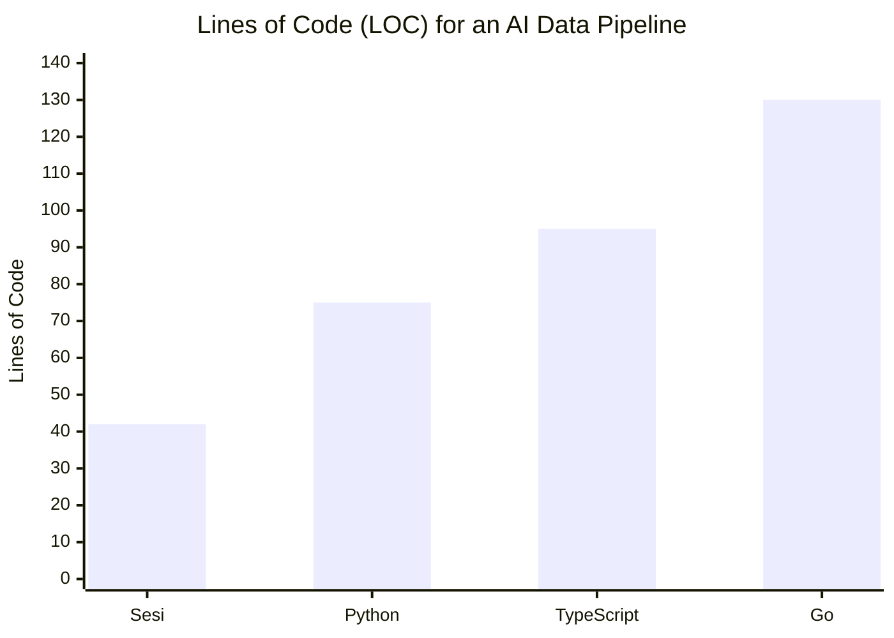
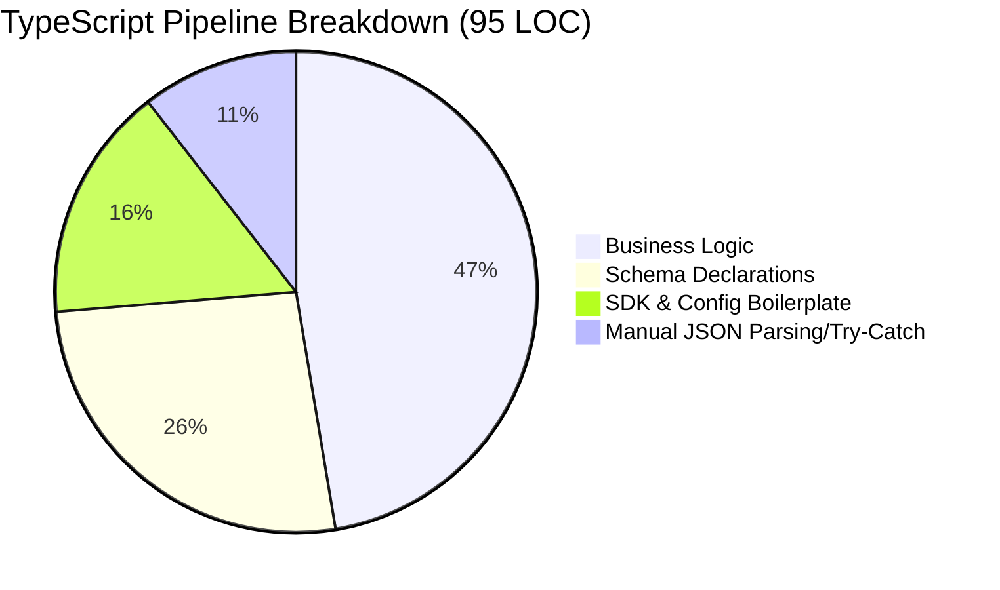
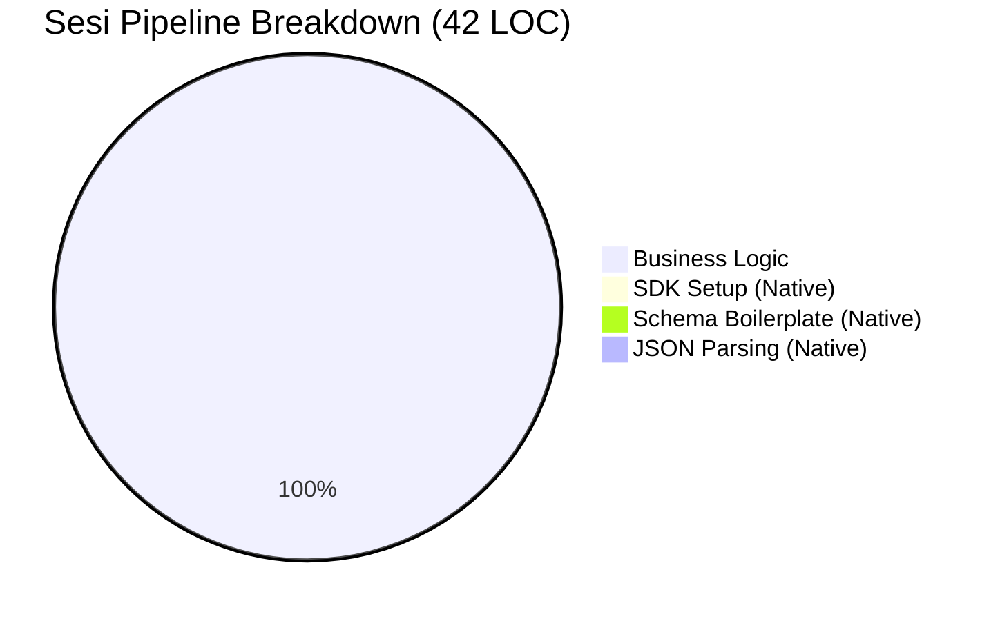

# The Sesi Advantage: Why We Built an AI-Native Language

Integrating Large Language Models (LLMs) into traditional applications today is painful. Standard programming languages treat AI as an external service requiring SDKs, manual prompt string concatenation, complex schema definitions, and fragile JSON parsing.

**Sesi treats AI as a first-class language primitive.**

This document demonstrates exactly how much boilerplate and complexity Sesi eliminates compared to traditional languages like TypeScript, Python, and Go.

---

## 📊 The Cost of Boilerplate: A Data Comparison

When building a simple AI-powered data pipeline (structured data extraction + conditional function calling), traditional languages spend more than half their code managing the SDK rather than executing business logic.



### Where do the lines go?





---

## 💻 The Side-by-Side Comparison

We tasked four languages with building the same script:
1. Loop over customer feedback.
2. Extract structured data (Sentiment, Category, Urgency).
3. If urgent, execute a local function (`escalateTicket`).

### 1. The Sesi Implementation (42 Lines)

In Sesi, there are no SDK imports, no manual API key initializations, no complex schema builder libraries, and no manual response parsing.

```sesi
fn escalateTicket(customerId: string, reason: string) {
  print "ESCALATION: Customer " + customerId + " for " + reason
  return "Escalation logged."
}

memory processingLog { "Pipeline Start:\n" }

let rawFeedback = [
  "My account was charged twice for the pro plan! Fix this now!",
  "The new dashboard is really clean, great job team."
]

for feedback in rawFeedback {
  processingLog = processingLog + "Processing: " + feedback + "\n"
  
  // 1. Native Structured Data Extraction
  let analysis = structured_output({
    sentiment: string,
    category: string,
    isUrgent: bool,
    summary: string
  })(
    model("gemini-3.1-flash-lite") {
      "Analyze the customer feedback.\n"
      "Feedback: " + feedback
    }
  )
  
  // 2. Native Conditional Tool Calling
  if analysis["isUrgent"] {
    let resolution = tool_call(escalateTicket)(
      model("gemini-3.1-flash-lite") {
        "Call escalateTicket for customer '1234' with a reason based on:\n"
        feedback
      }
    )
    processingLog = processingLog + "Urgent action taken: " + resolution + "\n"
  }
}
```

### 2. The TypeScript Implementation (95 Lines)

TypeScript requires the official Google Gen AI SDK. Notice how much code is dedicated just to telling the AI *what* we want it to do (Schemas, Tool Declarations) and *handling* what it gives back (JSON.parse).

```typescript
import { GoogleGenAI, Type } from "@google/genai";

const ai = new GoogleGenAI({ apiKey: process.env.GEMINI_API_KEY });

function escalateTicket(customerId: string, reason: string): string {
  console.log(`ESCALATION: Customer ${customerId} for ${reason}`);
  return "Escalation logged.";
}

// BOILERPLATE: Tool Declaration Schema
const escalateToolDeclaration = {
  functionDeclarations: [{
    name: "escalateTicket",
    description: "Escalate an urgent customer ticket",
    parameters: {
      type: Type.OBJECT,
      properties: {
        customerId: { type: Type.STRING },
        reason: { type: Type.STRING }
      },
      required: ["customerId", "reason"]
    }
  }]
};

async function processFeedback() {
  const rawFeedback = ["My account was charged twice..."];

  for (const feedback of rawFeedback) {
    // BOILERPLATE: Output Schema Declaration
    const schema = {
      type: Type.OBJECT,
      properties: {
        sentiment: { type: Type.STRING },
        category: { type: Type.STRING },
        isUrgent: { type: Type.BOOLEAN },
        summary: { type: Type.STRING }
      },
      required: ["sentiment", "category", "isUrgent", "summary"]
    };

    const analysisResponse = await ai.models.generateContent({
      model: "gemini-3.1-flash-lite",
      contents: `Analyze the customer feedback.\nFeedback: ${feedback}`,
      config: { responseMimeType: "application/json", responseSchema: schema }
    });

    // BOILERPLATE: Manual JSON Parsing
    let analysis;
    try {
      analysis = JSON.parse(analysisResponse.text || "{}");
    } catch (e) { continue; }

    if (analysis.isUrgent) {
      const escalationResponse = await ai.models.generateContent({
        model: "gemini-3.1-flash-lite",
        contents: `Call escalateTicket for customer '1234' based on:\n${feedback}`,
        config: { tools: [escalateToolDeclaration] }
      });

      // BOILERPLATE: Manual Function Call Routing
      if (escalationResponse.functionCalls && escalationResponse.functionCalls.length > 0) {
        const call = escalationResponse.functionCalls[0];
        if (call.name === "escalateTicket") {
          const args = call.args as any;
          escalateTicket(args.customerId, args.reason);
        }
      }
    }
  }
}
```

### 3. The Python Implementation (75 Lines)

Python is cleaner than TypeScript thanks to `Pydantic`, but still requires significant setup for function calling and schema extraction.

```python
import os
import json
from google import genai
from pydantic import BaseModel

client = genai.Client(api_key=os.environ["GEMINI_API_KEY"])

def escalate_ticket(customer_id: str, reason: str) -> str:
    print(f"ESCALATION: Customer {customer_id} for {reason}")
    return "Escalation logged."

# BOILERPLATE: Pydantic Schema Definition
class FeedbackAnalysis(BaseModel):
    sentiment: str
    category: str
    is_urgent: bool
    summary: str

def process_feedback():
    raw_feedback = ["My account was charged twice..."]

    for feedback in raw_feedback:
        response = client.models.generate_content(
            model='gemini-3.1-flash-lite',
            contents=f'Analyze the customer feedback.\nFeedback: {feedback}',
            config={'response_mime_type': 'application/json', 'response_schema': FeedbackAnalysis}
        )
        
        # Parse Pydantic object
        analysis = FeedbackAnalysis.model_validate_json(response.text)
        
        if analysis.is_urgent:
            escalation_response = client.models.generate_content(
                model='gemini-3.1-flash-lite',
                contents=f"Call escalate_ticket for customer '1234' based on:\n{feedback}",
                config={'tools': [escalate_ticket]}
            )
            
            # BOILERPLATE: Manual Tool Routing
            for tool_call in escalation_response.function_calls:
                if tool_call.name == "escalate_ticket":
                    escalate_ticket(**tool_call.args)

if __name__ == "__main__":
    process_feedback()
```

### 4. The Go Implementation (130+ Lines)

In Go, statically typed strictness combined with AI responses creates massive struct-defining overhead. You must define deeply nested JSON structs, handle raw byte marshaling/unmarshaling, and manually map AI function call payloads to Go reflection or manual switch statements. Sesi replaces all 130 lines of this with just its native 40 lines.

## The Verdict

Sesi isn't just syntactic sugar. By embedding the AI runtime directly into the parser and interpreter, Sesi understands *intent*:
*   You don't serialize schemas; Sesi reads your literal `{ key: string }` map and builds the JSONSchema dynamically.
*   You don't parse responses; Sesi intercepts the HTTP response, validates the JSON, and hands you an object.
*   You don't route tool calls; Sesi pauses execution, executes the function reference in the current environment, and resumes automatically.

**Less boilerplate. Fewer bugs. Faster development.**
