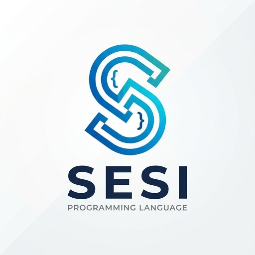

# Reasoning & Simple Logic

## Overview

In Sesi, Reasoning is used to evaluate state, make logical decisions, and handle complex patterns. This guide covers how to leverage Sesi's built-in Reasoning functions (`model`, `image`, `workflow`) to build scripts for your designated needs.

## 1. Prompting

In Sesi, calling a reasoning model is as simple as defining a string and executing it.

Prompts are **composable message templates** that evaluate to strings.

### Basic Prompt

```sesi
prompt simplePrompt {"Hello, Sesi!"}
show simplePrompt  // "Hello, Sesi!"
```

### Prompts with Variables

```sesi
let name = "Alice"
prompt greeting {"Hello, "name"! How are you?"}
show greeting  // "Hello, Alice! How are you?"
```

### Composing Prompts

```sesi
prompt part1 {"First part "}
prompt part2 {part1 "Second part"}
show part2  // "First part Second part"
```

### Prompts in Functions

```sesi
let title = "Sesi"
let theme = "Premium with cool blues."
let output = "index.sesi.html"
fn makePage(title: string, theme: string, output: string) -> string {
  prompt build {"Create a beautiful landing page with the title "title". Make the theme "theme}
  let generated = ""
  try {
    generated = model("gemini-3.5-flash-lite") {build}
  } catch (e) {
    show e
  }
  write_file(output, generated)
  return generated
}
show makePage(title, theme, output)
```

## 2. Model Calls

Call a Reasoning model with a prompt and get back text.

### Basic Model Call

```sesi
let response = model("gemini-3-flash-preview") {"What is machine learning?"}
show response
```

### Model Configuration

```sesi
let creative = model("gemini-3.6-flash") {thinkingLevel: "low"} {"Write a creative poem about technology."}
show creative

// Config options:
// - thinkingLevel: "minimal", "low", "medium", "high" (natively configures Gemini's reasoning budget)
// - max_tokens: max length of response (OPTIONAL: if not specified, will use the model's default max tokens=4096)
// - temperature: creative variation (OPTIONAL: defaults to 0.1 for high-fidelity reasoning precision)
// - top_k / top_p: parameter options for specialized sampling configurations

// Aliases are also supported in model config:
// - thinking -> thinkingLevel
// - temp -> temperature
// - maxT -> max_tokens

let modelName = "modelName"
set_alias(modelName, "gemini-3-flash-preview")
let thinking = "low"
let temp = 0.3
let maxT = 1024
let q = read_file("README.md")
let res = model(modelName) {thinking, temp, maxT} {"Summarize this in one sentence: "q}
show res
```

### Streaming Responses

Stream model output chunk-by-chunk in real time using the `stream` config key.

- **`stream: true`** — Streams tokens directly to stdout as they arrive.
- **`stream: callback`** — Passes each chunk to a Sesi function as it arrives.

```sesi
// Option 1: Stream directly to stdout
let resp = model("gemini-3.6-flash") {stream: true} {"Explain how compilers work in detail."}

// Option 2: Handle chunks with a callback
fn onChunk(chunk) {
  show "chunk:" chunk
}
let resp2 = model("gemini-3.6-flash") {stream: onChunk} {"Write a short story about a robot."}
```

> **Note:** Both modes return the full accumulated response string when complete, so the return value can still be used for file I/O or further processing.

```sesi
// Stream to stdout AND use the result afterward
let summary = model("gemini-3.5-flash-lite") {stream: true} {"Summarize this article: "text}
write_file("summary.txt", summary)
show "Saved to summary.txt"
```

### Model Selection

```sesi
// Fast model for simple tasks
let text = "Coding with Reasoning programming language is fun!"
let quick = model("gemini-3.5-flash-lite") {"Summarize this in one sentence: "text}

// Powerful model for complex reasoning
let code = "def calculate_sum(n):
    total = 0
    for i in range(1, n):
        total += i
    return total"
let smart = model("gemini-3.1-pro-preview") {"Analyze this code for bugs: "code}

// Efficient model for many calls
let item = "Programming Languages"
let cheap = model("gemini-3.6-flash") {thinkingLevel: "minimal"} {"Classify: "item}

show quick
show smart
show cheap
```

### Available Models

#### Flash Models

- `gemini-2.5-flash` - Legacy, but supported. 1M tokens.
- `gemini-2.5-flash-lite` - Legacy, but supported. Cheapest output cost. 1M tokens.
- `gemini-3-flash-preview` - Fast, most balanced model for coding and minimal tasks.
- `gemini-3.1-flash-lite` - Fastest, most cost-efficient for lightweight tasks.
- `gemini-3.5-flash` - Balanced, but token hungry (USE WISELY). Supports all native thinking effort levels (`minimal`, `low`, `medium`, `high`).
- `gemini-3.5-flash-lite` - Faster 3.5 model for high-throughput execution like subagent work and document parsing.
- `gemini-3.6-flash` - Newest model. Stronger performance on complex agentic and multimodal tasks while reducing token usage, at a lower price point than 3.5 Flash.

#### Pro Models

- `gemini-2.5-pro` - Legacy, but supported. 1M tokens.
- `gemini-3.1-pro-preview` - Most powerful reasoning model, doesn't support `minimal` thinking (falls back to `low`).

#### Image Models

- `gemini-2.5-flash-image` - Standard image model. (No `512` image size support for this model. Only `1K` is supported.) Most cost efficient.
- `gemini-3.1-flash-image` -  Most consistent image generation model.
- `gemini-3.1-flash-image-lite` - Fastest and cheapest image model, engineered for velocity and scale where speed and cost are the primary operational constraints. Not optimized for multiple reference inputs or multi-turn sequential editing.
- `gemini-3-pro-image` - High quality image generation model. (No `512` image size support for this model.)

#### OpenAI GPT Models

- `gpt-*` models are supported through `model()` for text generation and visual input.
- `gpt-*` models are also supported through `image()` when you want GPT image generation.
- Set `OPENAI_API_KEY` in your environment to enable GPT calls.
- GPT calls support streaming, `system` instructions, local image files via `images`, and web search via `search: true`.
- GPT tool schemas can be passed via `tools` in model config.
- Sesi audio input currently requires a Gemini model.

```sesi
let answer = model("gpt-5.6-sol") {"Summarize this document in 3 bullets."}
show answer

fn onChunk(chunk) {
  show "chunk:" chunk
}

let streamed = model("gpt-5.6-terra") {stream: onChunk, thinkingLevel: "low", max_tokens: 400} {"Explain event streaming in one paragraph."}
show streamed

let current = model("gpt-5.6-luna") {search: true} {"What is the current capital of France?"}
show current
```

#### Local Models (Text)

`model("local")` runs a quantized ONNX/Qwen2.5 instruction model directly at runtime.

```sesi
let answer = model("local") {max_tokens: 256, temperature: 0.3} {"What is the best thing about local AI usage?"}
show answer
```

The default model is `onnx-community/Qwen2.5-0.5B-Instruct`. Its weights are
downloaded on first use and cached under `~/.cache/sesi/models`. Set
`SESI_LOCAL_MODEL`, `SESI_LOCAL_DTYPE`, `SESI_LOCAL_DEVICE`, or
`SESI_LOCAL_CACHE_DIR` to configure the provider. Use
`model("local:model-id")` to select a model for one call.

#### Planned for (v2+)

- `HuggingFace` integration (In-Progress)
- `Midjourney` integration
- `Newer Reasoning Models` - Native upgrades

### Passing Images as Input

Pass one or more local image files to `model()` or `image()` via the `images` config key. The runtime reads each file, base64-encodes it, and injects it as a vision part before the prompt text.

```sesi
// Single image
let referenceImage = "stills/frame_03.jpg"
let caption = model("gemini-3-flash-preview") {images: referenceImage} {"What is the subject of this photograph?"}
show caption

// Multiple images
let pair = ["ref_a.png", "ref_b.png"]
let diff = model("gemini-3-flash-preview") {images: pair} {"List every visual difference between these two."}
show diff

// Mixed with other config keys
let scannedDocument = "doc_scan.jpg"
let result = model("gemini-3.6-flash") {images: scannedDocument, thinkingLevel: "low", max_tokens: 4096} {"Transcribe all text visible in this scan."}
write_file("transcript.txt", result)
```

See [Image Generation & Input](IMAGE_GENERATION.md) for the full reference.

## 3. Structured Output

Get typed responses from Reasoning with field validation.

### Basic Structured Output

```sesi
let analysis = structured_output({sentiment: string, confidence: number, summary: string})(model("gemini-3-flash-preview") {"Analyze sentiment of: " text "Return JSON with sentiment, confidence (0-1), and summary"})
show analysis["sentiment"]    // "positive"
show analysis["confidence"]   // 0.85
show analysis["summary"]      // "..."
```

### Schema Definition

```sesi
// Schema is a record with field types
let schema = {title: string, author: string, pageCount: number, tags: string, isFiction: bool}
let bookInfo = structured_output(schema)(model("gemini-3-flash-preview") {"Extract book metadata as JSON from: "description})
show bookInfo["title"]
```

### Parsing Tips

- Always include instructions for JSON format
- Specify the exact schema in the prompt
- Use "thinkingLevel": "minimal" for fast, consistent parsing
- Validate output structure in code

```sesi
let listText = "eggs, milk, bread, cheese, fruit, vegetables"
let output = structured_output({items: string})(model("gemini-3.6-flash") {thinkingLevel: "minimal"} {"Return JSON with items array containing: "listText})

// Validate
if type(output["items"]) == "array" {show "Got" str(len(output["items"])) "items"} // Got 6 items
```

## 4. Tool Calls (Function Calling)

Let Reasoning call functions in your program.

### Define Callable Functions

```sesi
let city = "New York"
fn getWeather(city: string) -> string {
  let weather = model("gemini-3.5-flash-lite") {"What is the weather like in "city}
  return weather
}
show getWeather(city)

// When defined inside a function, local variables MUST be defined on new lines.
fn calculateTax(amount: number, rate: number) -> number {
  let amount = 100
  let rate = 0.08
  return amount * rate
}
show calculateTax()
```

### Reasoning Makes Tool Calls

```sesi
let tax = tool_call(calculateTax)(model("gemini-3.5-flash-lite") {"Calculate 8% sales tax on $100"})
show tax  // 8.0
```

### Multiple Tool Availability (Future)

```sesi
// v2: Allow Reasoning to choose from multiple tools
let result = with_tools([getWeather, calculateTax, getTime]) {model("gemini-3-flash-preview") {"What's the weather in NY and the sales tax on $50?"}}
```

## 5. Memory & Conversation

Maintain context across multiple Reasoning calls.

### Simple Memory

```sesi
memory chat {"You are a helpful assistant. Be concise."}

// First turn
let response1 = model("gemini-3-flash-preview") {chat "User: Hello!"}

// Update memory with conversation
chat = chat + "Assistant: " + response1

// Second turn
let response2 = model("gemini-3.5-flash-lite") {chat "User: How are you?"}
show response2  // Has context from turn 1
```

### Memory in Functions

```sesi
memory conversation {"Chat history: "}
fn chat(userMessage: string) -> string {
  let fullPrompt = conversation + "User: " + userMessage
  let response = model("gemini-3-flash-preview") {fullPrompt}

  // Append to memory
  conversation = conversation + "User: " + userMessage + "Assistant: " + response
  return response
}
let msg = "What is the capital of France? "
show "User:" msg
show "Assistant:" chat(msg)
show "Updated Memory!"
```

### Memory Best Practices

- Keep memory concise to save tokens
- Summarize old messages periodically
- Reset memory when topic changes
- Monitor token usage

```sesi
// Summarize old memory
memory conversation {"User: Hello! Assistant: Hi there! User: How are you? Assistant: I'm great!"}
fn summarizeMemory(conversation: string) -> string {
  let oldConversation = conversation
  let summary = model("gemini-3.5-flash-lite") {"Summarize this conversation concisely: "oldConversation}
  conversation = "Previous summary:" + summary + "Recent messages: " + oldConversation
  return conversation
}
show "Original Memory:" conversation
show "Summarized:" summarizeMemory(conversation)

```

## 6. Practical Patterns

### Classification

```sesi
let categories = "fruit, vegetable, grain"
let item = "banana"
fn classify(item: string, categories: string) -> string {
  return model("gemini-3.6-flash") {thinkingLevel: "minimal"} {"Classify this item into one category. Categories: "categories" 
  Item: "item" 
  Return only the category name."}
}
show "Item: " item //banana
show "Category: " classify(item, categories) //fruit
```

### Extraction

```sesi
let text = "Elon Musk is the CEO of Tesla and SpaceX."
fn extractEntities(text: string) -> object {
  let result = structured_output({people: string, places: string, organizations: string})(model("gemini-3.6-flash") {thinkingLevel: "minimal"} {"Extract named entities from: "text})
  show "Name(s) found: result"
  return result
}
show extractEntities(text)

```

### Translation

```sesi
let text = "Good morning"
let language = "es"
let translation = translate(text, language, "en", "gemini-3.5-flash-lite")
show "Translation:" translation
```

### Web Search Grounding

Access real-time information by enabling the `search` shorthand configuration natively.

```sesi
let response = model("gemini-3.5-flash-lite") {search, max_tokens: 200} {"What is the weather in Tokyo right now?"}
show response
```

### Image Generation

Like `model`, the `image` command evaluates prompts and accepts configuration variables mapping accurately to backend SDKs requirements.

```sesi
let logo = image("gemini-3.1-flash-image") {ratio: "1:1", size: "512"} {"A high quality vector logo representing a new programming language named Sesi"}
write_image("logo.png", logo)
show "Image generated!"
```


GPT image models work here too, so you can use `image("gpt-image-2")` with the same Sesi flow and write the returned base64 payload with `write_image()`.


### Code Generation

```sesi
let requirement = "Write a function that reverses a string."
fn generateCode(requirement: string) -> string {
  return model("gemini-3.6-flash") {thinkingLevel: "low"} {"Generate JavaScript code for: "requirement" 
  Only provide code, no explanation."}
}
show "Code generation:"
show generateCode(requirement)
```

### Analysis

```sesi
let text = "I love Sesi!"
fn analyzeSentiment(text: string) -> object {
  return structured_output({sentiment: string, score: number, explanation: string})
  (model("gemini-3-flash-preview") {"Analyze sentiment of: "text})
}
show "Sentiment analysis:"
show analyzeSentiment(text)
```

## 7. Error Handling

Reasoning operations can fail. Handle gracefully.

### Try/Catch

```sesi
try {
  let response = model("gemini-3-flash-preview") {"Analyze "text}
  show response
} catch (e) {show "Reasoning call failed" e}
```

### Current Failure Behavior

- `model()` throws when the Gemini SDK fails or when no text is returned. `MAX_TOKENS` finish reasons are handled natively via a polling loop to automatically complete long outputs.
- `structured_output()` first tries to parse JSON from the model text, then retries with a coercion prompt.
- If structured parsing still fails, the runtime currently logs the error and returns `{}`.

### Validation After Success

```sesi
let text = "Coding is evolving rapidly!"
fn safeAnalyze(text: string) {
try {
  let result = structured_output({sentiment: string, score: number})
  (model("gemini-3.5-flash-lite") {"Analyze sentiment, score, and return JSON for: "text})
  if len(keys(result)) == 0 {
    show "Structured parsing failed."
    break
  }
  return result
} catch (e) {
  show e
  }
}
show "Analysis Result:" safeAnalyze(text)
```

## 8. Performance Tips

### Minimize API Calls

```sesi
// Bad: Calls API 3 times
for item in items {
  let analysis = model("gemini-3.5-flash-lite") {"Analyze: "item}
}
show analysis

// Better (Option 1): Batch into one call
let mName = "gemini-3.5-flash-lite"
let analyses = model(mname) {"Analyze each: "join(items, " ")}
show analyses

// Better (Option 2): True parallel calls using multi_req
fn req1() {return model(mName) {"Analyze: "items[0]}}
fn req2() {return model(mName) {"Analyze: "items[1]}}
fn req3() {return model(mName) {"Analyze: "items[2]}}
let parallelRun = multi_req([req1, req2, req3])
show parallelRun
```

### Use Cheaper Models for Simple Tasks

```sesi
// Simple classification → flash-lite
let category = model("gemini-3.5-flash-lite") {"Classify: "item}
show category

// Complex reasoning → pro
let analysis = model("gemini-3.1-pro-preview") {"Deep analysis of: "complex_problem}
show analysis
```

### Reduce Token Usage

```sesi
/* Long prompts waste tokens
Bad: */
let response = model("gemini-3-flash-preview") {"Here is a very long system prompt that repeats itself... Please analyze the following text very carefully... "text}
show response

// Better:
let response = model("gemini-3-flash-preview") {"Analyze: "text}
show response
```

### Cache Repeated Prompts

```sesi
// Bad: Same analysis done multiple times
for person in people {let assessment = model("gemini-3.5-flash-lite") {"Assess based on standard `A, B, C` criteria: "person}}
show assessment


// Better: Reuse cached prompt
let people = ["Elon Musk", "Bill Gates", "Steve Jobs"]
fn assessPerson(person: string) -> string {return model("gemini-3.5-flash-lite") {"Assess based on standard `A, B, C`: "person}}
for person in people {show assessPerson(person)}
```

## 9. Token Counting and Cost Estimation

Use `count_tokens()` before a request, `estimate_cost()` to budget it, and `model_usage()` after a request for provider-reported usage. Gemini counting uses Gemini's native API; use `estimate_tokens()` when you explicitly want an offline approximation.

```sesi
let text = "Summarize this conversation concisely."
let tokens = count_tokens(text, "gpt-5.6-sol")
show "Token count:" tokens

let planned = estimate_cost("gpt-5.6-sol", tokens, 500)
show "Planned maximum cost (USD):" planned["total_cost_usd"]

let response = model("gpt-5.6-sol") {max_tokens: 500} {text}
let actual = model_usage()
show "Actual tokens:" actual["total_tokens"]
show "Estimated actual cost (USD):" actual["total_cost_usd"]

// Plan memory size with declared values
memory conversation {"User: Hello\nAssistant: Hi there"}
let MAX_TOKENS = 1000000
let memoryTokens = count_tokens(conversation, "gpt-5.6-sol")
let remaining = MAX_TOKENS - memoryTokens
if remaining < 500 {conversation = summarizeMemory(conversation)}
show "Memory token count:" memoryTokens
```

`model_usage()` uses the actual counts returned by the provider. Pricing is a dated paid-tier snapshot and excludes tool calls, caching, media, taxes, free-tier allowances, and negotiated discounts.

The token APIs are deliberately separate:

- `tokenize()` returns OpenAI-compatible token IDs and does not accept Gemini as an OpenAI encoding.
- `count_tokens()` uses OpenAI's native `responses/input_tokens` endpoint for GPT models and Gemini's native `models.countTokens` endpoint for Gemini.
- `estimate_tokens()` is always local and may approximate unsupported/non-OpenAI tokenizers with `o200k_base`.

## 10. Advanced: Custom Reasoning Workflows

### Multi-Stage Reasoning Workflow

```sesi
let text = "Climate change is a long-term shift in global or regional climate patterns. Often climate change refers specifically to anthropogenic climate change, which is caused by human activities, primarily fossil fuel burning, which increases heat-trapping greenhouse gas levels in Earth's atmosphere. The term is frequently used interchangeably with the term global warming, though the latter refers specifically to the long-term heating of Earth's climate system observed since the pre-industrial period due to human activities."

fn smartSummarize(text: string) -> string {
  /* 
    Chain multiple Reasoning operations
    Step 1: Extract key points
  */
  let keyPoints = model("gemini-3.1-pro-preview") {thinkingLevel: "low"} {"Extract 5 key points from: " text}

  // Step 2: Analyze topics
  let topics = structured_output({topics: string})(model("gemini-3.6-flash") {thinkingLevel: "low"} {"Identify topics in: "keyPoints})

  // Step 3: Generate summary
  let summary = model("gemini-3-flash-preview") {"Summarize with topics "topics": "keyPoints}
  return summary
}
show "Summary:" smartSummarize(text)
```

### Reasoning Pattern

```sesi
let analysis = model("gemini-3.6-flash") {thinkingLevel: "medium", max_tokens: 8192} {"Reason carefully about: "problem}
show analysis
```

### Few-Shot Prompting

```sesi
let text = "banana"
fn classifyWithExamples(text: string) -> string {
  return model("gemini-3.6-flash") {thinkingLevel: "minimal"} {"Classify as A, B, or C. Examples: 'apple' -> A , 'dog' -> B , 'happy' -> C. "text}}
show "Classification:" classifyWithExamples(text)
```

---

## 11. Built-in Tools

### Built-in Workflows

Sesi provides a native `workflow` function to easily chain reasoning steps:

```sesi
let steps = [
  {"prompt": "Summarize: "},
  {"prompt": "Critique: "},
  {"prompt": "Finalize: "}
]
let result = workflow(steps, "Design a landing page brief")
show result["final"]
```

### Model Aliases

You can define custom names for models using `set_alias`:

```sesi
set_alias("fast", "gemini-3.5-flash-lite")
let answer = model("fast") {"Summarize this paragraph: "}
show answer
```

### Custom Tools

Sesi allows you to define custom tools that can be invoked during reasoning operations.

```sesi
fn get_weather(city: string, conditions: string) -> string {return "It is currently " + conditions + " in " + city}
// Register the tool
define_tool("weather", get_weather, "Get weather for a city")

// List available tools
show list_tools()

// Call the tool
let weatherData = structured_output({city: string, conditions: string})
(model("gemini-3.5-flash-lite") {search} {"What is the weather like in London? Return JSON with the exact 'conditions' and 'city' name."})
let result = tool_call(weather)(weatherData["city"], weatherData["conditions"])
show result
```

---

## See Also

- [Quick Start Guide](../QUICKSTART.md)
- [Language Specification](SPECIFICATION.md)
- [Runtime Architecture](ARCHITECTURE.md)
- [Built-in Functions Reference](BUILTINS.md)
- [Command Line Interface (CLI) Reference](CLI.md)
- [Image Generation & Input](IMAGE_GENERATION.md)
- [Compare to other languages](COMPARISON.md)
- [Reasoning & Simple Logic](REASONING.md)
- [Examples](../examples)
