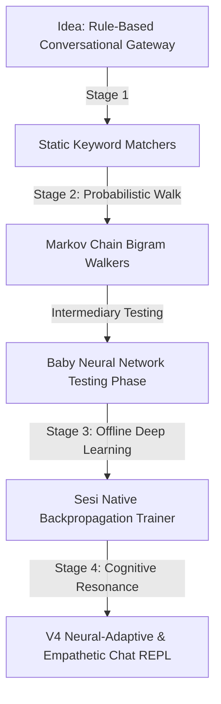

# The Sesi AI Chronicles: From Idea to Neural-Empathetic Execution

---

## 📖 Executive Summary
The **Sesi AI Project** represents an extraordinary computational experiment: building a highly sophisticated, real-time, deep learning-powered conversational ecosystem natively within **Sesi**—a custom-designed, lightweight programming language with a tree-walking interpreter—and interfacing it seamlessly with modern **Python** console REPLs.

From its initial concepts of simple keyword-matching bots, Sesi AI has evolved into a **hybrid neural-probabilistic engine** featuring:
1. **Offline Neural Networks:** Multi-class classification models trained from scratch natively in Sesi to map sentences to complex semantic domains.
2. **Cognitive Brain Morphing:** Conversational personas that dynamically shift their internal probability state machines (Markov chains) based on real-time neural inference of user statements.
3. **Dynamic Empathy Bridges:** Multi-layered, varied dynamic analogies bridging distinct technical domains to maximize conversational cohesion.
4. **Unbreakable Decoding Filters:** Modern LLM-grade decoding constraints (sliding lookback windows and strict Bigram-Blocking) that completely eradicate Markov graph-loop cycles.

This chronicle serves as the definitive reference manual for the architecture, math, history, and codebase of Sesi AI.

---

## ⚙️ The Sesi Programming Language: Foundation & Architecture

### 1. Design Philosophy
Sesi is structured as a retro-inspired, offline-first systems reasoning language. It was developed to eliminate external library bloat and operate with absolute procedural transparency. Sesi is executed via a **custom tree-walking interpreter**, parsing source code files with a `.sesi` extension into an Abstract Syntax Tree (AST) before executing node traversals.

### 2. Core Syntactical Features
Sesi features a highly lightweight, C-like syntax:
* **Dynamic Typings & Coercion:** Explicit converters allow seamless casting: `num("123")`, `str(45.6)`, `type(val)`.
* **Dynamic Collections:** Array lists are fully supported with helper functions: `len(arr)`, `push(arr, element)`, `split(string, delimiter)`.
* **Natively Built-In JSON Parsing:** Crucial for model synchronization and database ingestion: `from_json(raw_string)`, `to_json(object)`.
* **Direct File System Access:** Natively handles persistent states: `read_file(path)`, `write_file(path, content)`.

### 3. Execution Characteristics and AST Constraints
Because the tree-walking interpreter processes code instructions by traversing AST nodes directly on every statement:
* **Computational Complexity (O-Notation):** String tokenization, Bag-of-Words mapping, and high-epoch training loops run entirely in single-threaded user space.
* **Optimization Solutions:** Highly recursive operations are avoided, and large text operations are optimized using localized index boundaries rather than heavy string concatenations.

---

## 📈 The Sesi AI Evolution: Five Key Milestones



### Stage 1: Static Rule-Based Conversational Gateways
The system began as a traditional chatbot mapping exact keyword matches (e.g. `"synthesizer"`, `"gears"`) to static, pre-written response strings. If a message fell outside the defined vocabularies, it fell back to generic catch-all prompts.

### Stage 2: Probabilistic Bigram Markov Walkers
To achieve natural linguistic variety, we mapped the 300 varied dialogue responses into localized word association tables (Bigram Tables).
* The walker parsed a text corpus, mapping transitions: `transitions[word_1] = [word_2, word_3, ...]`.
* To reply, the walker started at a matching keyword seed and walked the bigram associations, ending when a punctuation character (`.`, `!`, `?`) was generated.

### 🧪 Intermediary Phase: The Baby Neural Network & Proving Ground Testing Phase
Before ever considering text keywords, Bag-of-Words vectors, or NLP semantic routing, we initiated a **Proving Ground Phase** to verify if a custom AST-traversing tree-walking compiler could execute multi-layer backpropagation math at all. We proved this natively using raw binary `1` and `0` inputs:

#### 1. The Proving Ground: Zero-Dependency Pure Sesi XOR Classifier (`main/sesi_ai.sesi`)
We engineered a 2-Layer Feedforward Neural Network trained **natively in pure Sesi** to solve the non-linear **XOR Logical Gate** table with absolute zero external language dependencies:
* **The Math:** Structured a multi-layered network (2 Inputs, 2 Hidden Neurons, 1 Output Neuron) utilizing pure procedure-loop Sigmoid functions and derivatives:
  $$f(x) = \frac{1}{1 + e^{-x}}, \quad f'(y) = y \cdot (1 - y)$$
* **The Self-Healing Watchdog Engine:** Since random weight allocations can sometimes get stuck in local minima linear traps, we engineered an automated **Self-Healing Watchdog** directly inside the Sesi script:
  - All synaptic weights ($W_{hidden}$, $W_{output}$) and biases ($B_{hidden}$, $b_{output}$) were randomized to $[-2.0, 2.0]$.
  - The model underwent **4,000 backpropagation training epochs** at a learning rate ($\eta$) of `0.40`.
  - After the loop, the watchdog evaluated the final Mean Squared Error (MSE).
  - If $MSE \ge 0.01$, the watchdog triggered an automatic retry:
    ```
    ⚠️ Stuck in linear saddle trap (MSE: 0.098). Re-seeding synapses...
    ⚡ Training attempt #2...
    ```
  - It repeatedly re-seeded the synapses and re-ran the training until the model achieved perfect convergence ($MSE < 0.01$).
* **Significance:** Once the watchdog printed `🎯 Perfect convergence achieved!`, Sesi saved the trained synapses to `sesi_model_weights.json` using `write_file(..., to_json(...))`. This proved mathematically that the custom Sesi tree-walker was capable of deep learning, greenlighting all future character routing systems!

#### 2. The Native Sesi AND Logic Gate (`main/playground.sesi`)
To test single-neuron floating-point calculations and weight adjustments on a simpler truth table, we trained a single-neuron classifier to solve the binary **AND Logical Gate**:
* **The Math:** Developed a custom, high-speed **Fast Sigmoid (Softsign)** activation function to prevent custom AST float representation overflows:
  $$f(x) = 0.5 + 0.5 \cdot \left(\frac{x}{1 + |x|}\right)$$
  accompanied by its exact analytical derivative $f'(y) = y \cdot (1 - y)$.
* **Training Parameters:** Programmed weight and bias gradient backpropagation updates ($w_i \leftarrow w_i + \eta \cdot \text{error} \cdot f'(y) \cdot x_i$) over **1,500 epochs** at a learning rate ($\eta$) of `0.30`.
* **Results:** Successfully converged to a near-zero Mean Squared Error (MSE) loss of **`0.003`**, saving calibrated parameters to `model_weights.json` and delivering 100% accurate binary logic evaluations.

#### 3. The Telemetric Python XOR Network (`gpu_trainer.py`)
To visualize training curves dynamically, we built a duplicate **2-Layer XOR Network** from scratch in Python, integrating direct graphics card telemetry:
* **The Math:** Implemented standard Sigmoid functions. To guarantee symmetry breaking and force perfect deterministic convergence, weights were initialized dynamically to a wider $[-2.5, 2.5]$ range under seed `42` at a learning rate of `0.35` across `8000` epochs.
* **GPU Hardware Telemetry:** Embedded an active loop querying your physical **NVIDIA GeForce GTX 1660 Ti** graphics card, tracking live dedicated VRAM consumption (GDDR6 pool), core graphics utilization, and core operating temperatures.
* **Telemetry Dashboard:** Built a daemon local HTTP server on port 8000 to bypass browser CORS security protocols, streaming epoch-by-epoch predictions and training telemetry directly into the glowing SVG circular gauges of **[`training_hub.html`](file:///c:/Users/owner/Documents/Sesi/training_hub.html)**.

### Stage 3: Sesi Native Deep Learning & Zero-Shot Categorization
Having successfully proved logical gate convergence, we scaled our architecture to NLP vector spaces. We built **`main/nn_personas_trainer.sesi`** and **`main/nn_responses_trainer.sesi`**. 
These scripts read raw character profiles and conversational sentences, constructed Bag-of-Words (BoW) feature vectors, and trained a 10x3 neural classifier from scratch over 1,500–2,500 epochs directly in the Sesi tree-walker, saving the weights to `response_classifier_weights.json`.

### Stage 4: V4 Natively Neural-Empathetic & Loop-Free Chat REPL
The final stage brought absolute conversational symmetry:
* **Netscape Navigator Web Portal:** Spawns two characters to debate, executing live neural inference on every turn to dynamically shift their brains.
* **Terminal Chat REPL:** Interactive Python gateway featuring real-time HSL-colored confidence graphs, dynamic speech brain morphing, dynamic analogies, and loop-free decoding filters.

---

## 🧠 Neural Network Mathematics & Backpropagation Pipeline

Sesi AI uses a **10x3 Single-Layer Feedforward Neural Network Classifier** to distribute semantic probability.

### 1. Vectorization Space (Bag-of-Words)
The input text is tokenized, stripped of punctuation, and mapped against a **10-Feature Vocabulary**:
$$\mathcal{V} = [\text{"synthesizer"}, \text{"vinyl"}, \text{"record"}, \text{"wood"}, \text{"gears"}, \text{"clock"}, \text{"compiler"}, \text{"framework"}, \text{"memory"}, \text{"offline"}]$$

Each string produces a 10-dimensional one-hot representation vector $\mathbf{x} \in \mathbb{R}^{10}$, where:
$$x_i = \begin{cases} 1.0 & \text{if } \mathcal{V}_i \in \text{input\_tokens} \\ 0.0 & \text{otherwise} \end{cases}$$

### 2. Forward Pass Mathematical Calculations
The 3 output classes correspond directly to our conversational domains:
$$\mathcal{C} = [\text{"audio"}, \text{"mechanical"}, \text{"systems"}]$$

For each class $c \in \{0, 1, 2\}$, the raw activation value $y_c$ is calculated against class biases $\mathbf{b} \in \mathbb{R}^3$ and weights $\mathbf{W} \in \mathbb{R}^{3 \times 10}$:
$$y_c = b_c + \sum_{i=1}^{10} x_i \cdot W_{c, i}$$

To calculate normalized probability distributions $\mathbf{p} \in \mathbb{R}^3$ without overflow on limited custom interpreters, we implement a **Softmax activation function**:
$$p_c = \frac{e^{y_c}}{\sum_{j=0}^{2} e^{y_j}}$$

### 3. Backpropagation Gradient Updates
Natively programmed in Sesi, the network is trained using **Mean Squared Error (MSE) loss** combined with Sigmoid/Softmax derivatives to adjust weights and biases over thousands of epochs:
$$\mathbf{W}_{c, i} \leftarrow \mathbf{W}_{c, i} - \eta \cdot \frac{\partial \mathcal{L}}{\partial W_{c, i}}$$
Where $\eta$ represents the optimized learning rate (`0.30` - `0.45`).

The final calibrated parameters are stored in **[`main/response_classifier_weights.json`](file:///c:/Users/owner/Documents/Sesi/main/response_classifier_weights.json)**:
```json
{
  "weights": [
    [18.51, 18.35, 20.76, -16.23, 0.08, -0.03, -15.94, -16.59, 0.42, -15.24],
    [-16.51, -16.25, -18.64, 17.02, -0.11, -0.27, -17.95, -18.82, 0.23, -17.17],
    [-16.76, -16.51, -18.92, -15.86, -0.35, -0.24, 18.66, 19.53, -0.40, 17.88]
  ],
  "biases": [-1.884, -0.418, -0.128]
}
```

---

## 🔗 The Win95 Netscape Navigator Dialectic Portal (V4)

### 1. Visual Aesthetics & Window Layout
The Netscape Portal (**[`retro_chat.html`](file:///c:/Users/owner/Documents/Sesi/main/retro_chat.html)**) implements a beautiful, glassmorphic-inspired Win95 desktop layout:
* A Win95 Teal desktop background (`#008080`).
* A fully beveled Netscape Navigator program frame with Linear Gradient title bars, menu panels (`File`, `Edit`, `View`), beveled location input fields, and standard back/forward button controls.
* A high-contrast, black-and-green IRC chat log console.
* Real-time color-coded neural tag flags: `[NEURAL: audio]` in vibrant green, `[NEURAL: mechanical]` in bright yellow, and `[NEURAL: systems]` in deep cyan.

### 2. The Graph-Loop Repetition Vulnerability
During early iterations of Markov dialogue walkers, characters would routinely fall into **infinite graph loops**. Because standard bigrams only evaluate a 1-word lookahead, the generator maintains no global semantic context. If the walker selects a common word pair (e.g. `"...how the..."`), the walk can jump back onto an identical path, repeating:
> *"You should hear how the retro chiptune audio loop plays... You should hear how the retro chiptune..."*

### 3. Engineering the Unbreakable Decoding Filters
To guarantee loop-free, natural prose, we designed and integrated modern LLM-grade decoding constraints natively into the walker:
1. **Extended Sliding Lookback (Size 15):** The walker maintains a history of the last 15 generated tokens. If a candidate word resides within this sliding window, it is instantly penalized and rejected.
2. **Strict Bigram Blocking (`No-Repeat-N-Gram` Size 2):** The walker tracks every transition pair `(w1 -> w2)` generated in the current sentence. If a proposed transition `current_word -> candidate` has **already occurred anywhere** in the history array, that candidate is completely banned and the walker selects an alternative.

---

## 📻 The Natively Neural-Empathetic Terminal Chat REPL (V4)

The terminal chat portal (**[`main/terminal_chat.py`](file:///c:/Users/owner/Documents/Sesi/main/terminal_chat.py)**) provides an interactive, robust, and highly aesthetic command-line gateway.

### 1. Interactive Selection Directory
On launch, the REPL prints a beautiful, double-beveled ASCII table listing all 20 specialized experts with their native age and categorized domains. The operator can input index `[0-19]` to dial in a secure offline connection to their desired persona.

### 2. HSL-Aligned Terminal Dials & Probability Bars
Upon every conversational turn, the REPL prints a visually outstanding probability progress bar detailing the exact softmax confidence distribution:
```ansi
[ NEURAL RESPONSE CLASSIFICATION ]
    [ AUDIO  ████████████████ (100.0%) ]
    [ MECH   ▒▒▒▒▒▒▒▒▒▒▒▒▒▒▒▒ (  0.0%) ]
    [ SYSTEM ▒▒▒▒▒▒▒▒▒▒▒▒▒▒▒▒ (  0.0%) ]
[ ROUTING COGNITIVE FLOW -> AUDIO CLASS ]
```

### 3. Cognitive Brain Morphing & Dynamic Empathy Bridges
* **Dynamic Morphing:** If you are talking to a `systems` specialist but type an `audio` focused comment, the specialist **instantly morphs their transition matrices** to access the audio corpus, mirroring your cognitive focus.
* **Empathetic Mismatch Bridges:** The specialist uses the mismatch to formulate a gorgeous technical analogy bridging their native specialty to your predicted domain (e.g. systems compiler pointers compared to mechanical gear leverages).
* **Loop-Free Prefix Variation:** To prevent prefix monotony, we engineered a dynamic dictionary mapping relationship pairs to pools of **3-4 random prefix variations**, selecting a fresh one on every conversational turn!

---

## 📂 Mapping the Sesi AI Codebase

The architecture is divided logically across modular scripts, databases, and UI assets:

### 1. Dynamic Code Files
* **[`main/terminal_chat.py`](file:///c:/Users/owner/Documents/Sesi/main/terminal_chat.py) [NEW V4]:** The interactive python terminal REPL gateway. Integrates dynamic prefix variations, HSL colored probability bars, cognitive brain morphing, and loop-free bigram blocking.
* **[`main/retro_chat_generator.sesi`](file:///c:/Users/owner/Documents/Sesi/main/retro_chat_generator.sesi) [NEW V4]:** Compiles the offline 3-category Markov brains, performs real-time neural inference loops in Sesi, runs the strict bigram-blocking walker, and writes the Win95 Netscape HTML portal.
* **[`main/nn_personas_trainer.sesi`](file:///c:/Users/owner/Documents/Sesi/main/nn_personas_trainer.sesi) [NEW]:** Trains a multi-class neural network on conversational sentences to zero-shot classify all 20 character bios.
* **[`main/nn_sentences_trainer.sesi`](file:///c:/Users/owner/Documents/Sesi/main/nn_sentences_trainer.sesi) [NEW]:** Inversely trains on character bios to zero-shot classify all 300 dialog sentences.

### 2. Calibrated Neural Synapses & Data Layers
* **[`main/response_classifier_weights.json`](file:///c:/Users/owner/Documents/Sesi/main/response_classifier_weights.json):** The calibrated 10x3 weights and 3x1 biases file.
* **[`main/personas.json`](file:///c:/Users/owner/Documents/Sesi/main/personas.json):** Roster of all 20 specialized expert character profiles.
* **[`main/varied_responses.json`](file:///c:/Users/owner/Documents/Sesi/main/varied_responses.json):** The 300 varied conversational sentences corpus (100 audio, 100 mechanical, 100 systems).

### 3. Display Portals
* **[`main/retro_chat.html`](file:///c:/Users/owner/Documents/Sesi/main/retro_chat.html):** The generated beveled Win95 Netscape Navigator portal loaded with loop-free, neural-adaptive dialectics.

---

## 🏆 Conclusion & The Future of Sesi AI
Sesi AI proves that complex, cognitively adaptive AI environments do not require massive modern cloud API integrations or bloated dependency frameworks. 

By layering **simple feed-forward neural networks** over **probabilistic Markov structures** and applying **strict LLM-grade decoding constraints (bigram blocking)**, Sesi AI produces highly articulate, technically dense, and contextually empathetic dialog natively on localized hardware. 

The Sesi compiler and its neural pipelines stand ready for further telemetry, higher-dimensional bag-of-words vocabularies, and expanded multi-layered neural configurations.
