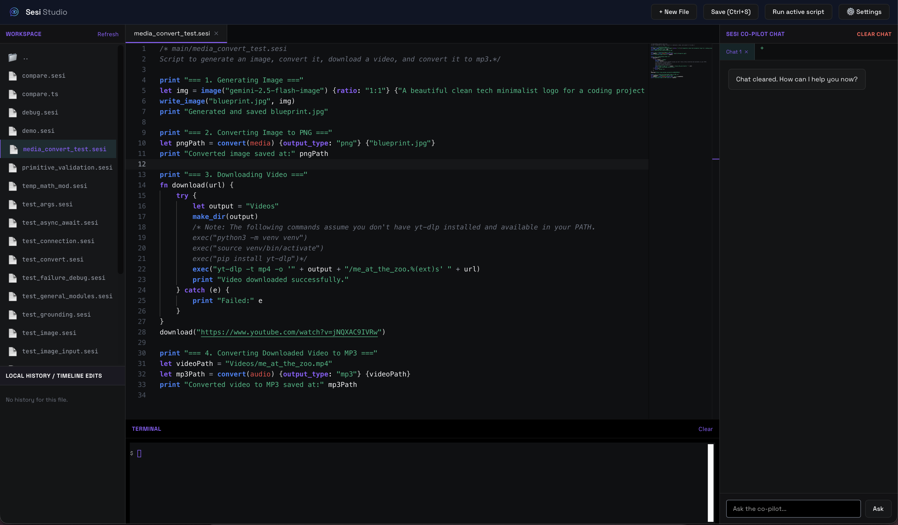

# Sesi Studio IDE

Sesi Studio is a premium, high-density development environment built specifically for the Sesi Programming Language and ClearHTML (CHTML). It provides a full-featured IDE experience directly in the browser, designed to work seamlessly with the native Sesi toolchain.



## Key Features

### 💎 High-Fidelity Editor

- **Monaco Core**: Powered by the same engine as VS Code.
- **Sesi & CHTML Syntax**: Full, 1:1 syntax highlighting for `.sesi` and `.chtml` files.
- **Bracket Pair Colorization**: Visually track nesting levels with color-coded brackets.
- **Code Folding & Minimap**: Navigate large scripts with ease.

### 🧠 Intelligence & Navigation

- **Command Palette**: Triggered via `Cmd+P` or `Ctrl+P`, enabling rapid search and execution of all workspace tasks, editor actions, zoom adjustments, terminal commands, and theme operations.
- **Document Symbols**: Quickly jump to functions and variables using `Cmd+Shift+O`.
- **Go to Definition**: Right-click or `Cmd+Click` any symbol to jump to its declaration.
- **Smart Autocomplete**: Local symbol suggestion combined with native Sesi keyword IntelliSense.
- **Hover Documentation**: View signatures and examples for built-in functions by hovering over code.

### 🛠 Integrated Toolchain

- **Native Terminal**: A real-time, bidirectional xterm.js terminal connected to your local system shell.
- **Run with One Click**: Execute your Sesi scripts instantly with the "Run" button or `F5`.
- **Workspace Explorer**: Manage your local repository files with a persistent sidebar.
- **Local History**: Automatic "Timeline" saves of your file edits, stored safely in IndexedDB.

### 🤖 Autonomous Sesi Co-Pilot & Subagents

- **Autonomous SesiDo Agent**: Co-Pilot uses a full SesiDo loop to solve complex multi-step tasks like reading, writing, and listing files in the workspace.
- **Real-Time Streaming**: Watch the agent's step-by-step thoughts, tool invocations, and responses stream and render in real-time.
- **Conversation Memory**: Maintains deep, context-aware history across multi-turn sessions even during tool execution.
- **Image Generation Subagent**: A dedicated subagent handles prompt-refinement and leverages Sesi's native `image()` engine to write physical image assets directly to the workspace.
- **Code Execution & Validation**: Safely evaluates inline Sesi scripts and executes native helper scripts for automated refactoring.
- **Code Insertion**: Apply suggested code fixes directly into your editor with one click.
- **Multi-Chat Support**: Manage multiple reasoning threads simultaneously.

### 🔌 Custom AI Provider (Agentic)

- **Bring Your Own Model**: Configure custom AI endpoints (OpenAI, Gemini, Anthropic, Ollama, local LLMs) for chat and inline code completion.
- **Client-Side SesiDo Engine**: The custom provider features a client-side SesiDo interpreter, providing full tool-calling support (file I/O, code evaluation, helper scripts, and image subagents) to custom models.

### 🎨 Extensible Architecture

- **Theme Support**: Choose from built-in themes like "Classic Sesi", "Blueprint", or "Brutalist".
- **Extension & Theme Packagers & Installers**: Build CSS themes into portable `.sesitheme` bundles and JS extensions into `.sesiext` bundles using native packager utilities. Install new bundles instantly via the Command Palette or the Settings Hub.
- **Custom Extensions**: Add your own `.js` and `.css` files to extend the IDE's capabilities.
- **Rich Metadata**: Full support for extension icons, versions, authors, and descriptions.

## Getting Started

### Launching the Studio

- **Windows (Native App)**: Double-click `Sesi Studio.exe` in the project root to launch Sesi Studio as a standalone native window. If you want to rebuild the wrapper from source, run `build-app.bat`.
- **macOS / Linux**: Run the launcher script:
  ```bash
  ./SesiStudio.command
  ```
- **Manual CLI Launch**: Start the backend server manually from the repository root:
  ```bash
  sesi -s
  ```
  Then navigate to `http://localhost:3050` in your browser.

## Documentation

- [Extensions & Themes Guide](./EXTENSIONS.md): Learn how to build your own themes and tools for Sesi Studio.

## Technical Architecture

- **Frontend**: Vanilla JavaScript + Monaco Editor + xterm.js.
- **Backend**: Node.js Express server with WebSocket support for terminal PTY.
- **Storage**: IndexedDB for local history and chat persistence; native file system for workspace files.
- **Extensions**: Support for custom CSS themes and JS plugins via the `/extensions` directory.

---

_Built for speed, clarity, and the next generation of native systems programming._
