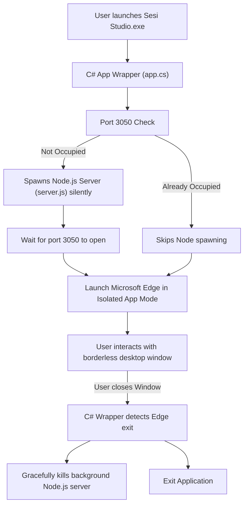

# Windows Desktop App Integration

Sesi Studio has been successfully integrated as a native Windows desktop application! The design follows the same clean, headless process orchestration paradigm used by the macOS WebKit host (`app.swift`), adapted to Windows APIs and compiler constraints.

## 🏛️ Architecture

To achieve a lightweight, zero-dependency, and high-performance desktop experience, Sesi Studio uses a hybrid C# and Edge-Chromium architecture:



### Key Design Highlights
1. **Zero External Dependencies**: Compiled natively using `csc.exe` (part of the Windows .NET Framework pre-installed on all Windows systems). No heavy SDK downloads (like Tauri or Electron) are needed, generating a tiny `15 KB` binary.
2. **Hidden Terminal Window**: The C# wrapper runs as a `winexe` application and spawns the Node.js server with `CreateNoWindow = true` and `UseShellExecute = false`. This guarantees no ugly black Command Prompt windows pop up when Sesi Studio is opened.
3. **Chromium Isolated Profile**: Microsoft Edge is launched in `--app` mode with a custom user data directory (`--user-data-dir`). This isolates Sesi Studio's cookies, history, and workspace cache from the user's main browser, and ensures that the Edge process stays tied directly to Sesi Studio's life cycle.
4. **Smart Multi-Instance Handling**: If Sesi Studio is launched while the port is already active (e.g. from an existing session), it skips restarting Node and opens a new Edge app window pointing to the running server.

---

## 🛠️ Build & Compilation

To build the native executable:

1. **Locate the Build Script**: Navigate to the `sesi-studio` folder.
2. **Run the Builder**: Execute `build-app.bat`.

The build script will:
* Find the system C# compiler (`csc.exe`).
* Compile `app.cs` into a windowed executable.
* Automatically embed the high-resolution Sesi icon (`favicon.ico`) directly into the final `Sesi Studio.exe` binary.
* Output the completed app to the parent repository root.

### Build Script Configuration (`sesi-studio/build-app.bat`)
```batch
@echo off
setlocal enabledelayedexpansion

echo === 🚀 STARTING SESI STUDIO WINDOWS NATIVE BUILD ===

:: Determine paths
set "STUDIO_DIR=%~dp0"
set "REPO_DIR=%STUDIO_DIR%.."
set "CSC_EXE=C:\Windows\Microsoft.NET\Framework64\v4.0.30319\csc.exe"
set "ICON_ICO=%REPO_DIR%\favicon.ico"
set "OUT_EXE=%REPO_DIR%\Sesi Studio.exe"

:: Compile native C# App Host with embedded icon
echo ⚙️  Compiling app.cs using csc.exe...
"!CSC_EXE!" /target:winexe /out:"!OUT_EXE!" /win32icon:"!ICON_ICO!" /reference:System.Windows.Forms.dll /reference:System.Drawing.dll /reference:System.dll /reference:System.Core.dll "%STUDIO_DIR%app.cs"

echo === 🎉 SESI STUDIO NATIVE WINDOWS APP BUILD COMPLETE ===
echo 📁 Created: !OUT_EXE!
```

---

## 📦 How to Run

Simply double-click the **`Sesi Studio.exe`** executable in the root directory. 

* The application will launch Sesi Studio in a borderless Chromium desktop window.
* When you exit Sesi Studio, all background Node.js processes are automatically terminated to keep your machine fast and clean.
